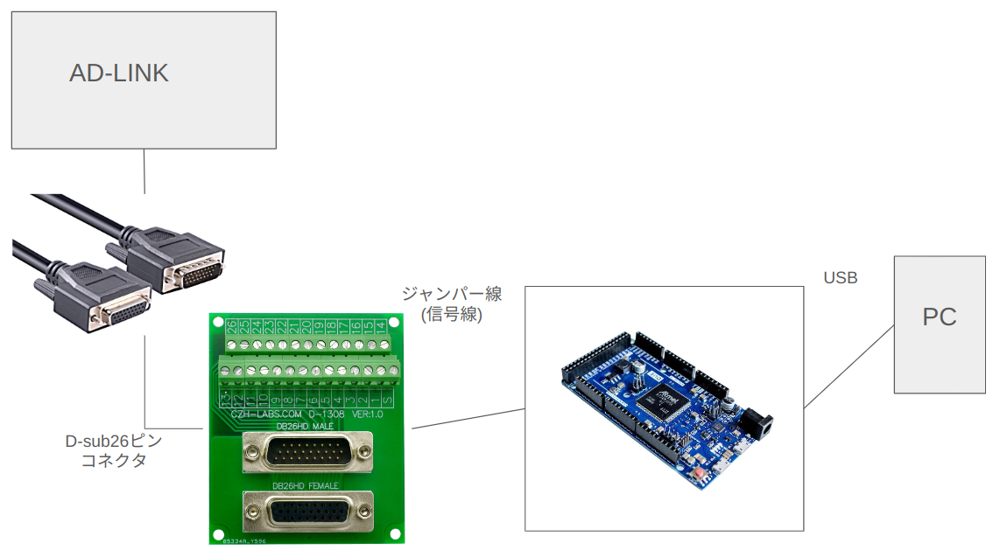
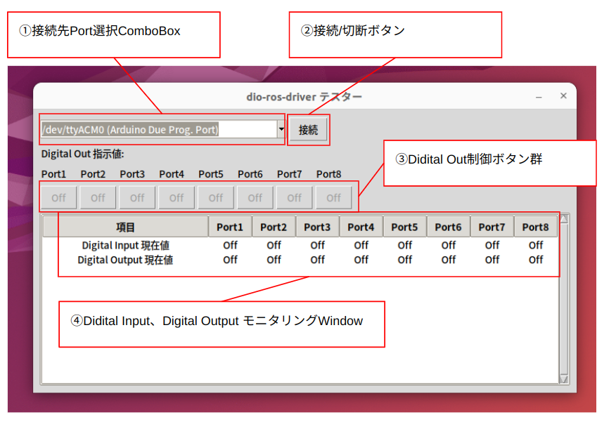

# DIO Tester Tool

Arduino Dueのデジタル入出力をテストするためのGUIツールです。ROS用のDIOドライバーの実機テストをサポートするために作られました。

## 概要

このツールは以下の機能を提供します：

- Arduino Dueとのシリアル通信を通じたデジタル入出力の監視
- 8チャンネルのデジタル入力(DI)状態の表示
- 8チャンネルのデジタル出力(DO)の制御
- リアルタイムの状態更新

## 必要要件

### ハードウェア
- Arduino Due
- USBケーブル（Arduino Due接続用）

### ソフトウェア
- Python 3.10.12
- TkEasyGUI
- pyserial
- Docker（コンテナ環境で実行する場合）

### Arduinoの設定
- デジタル入力ピン：30-37番（プルアップ抵抗有効）
- デジタル出力ピン：22-29番
- ボーレート：9600bps


## セットアップ方法

### 1. Arduinoの準備
1. Arduino IDEでスケッチを開きます
2. Arduino Dueにスケッチをアップロードします

### 2. アプリケーションの起動（Docker使用）



1. Arduino dueとテスト対象の機器(ex: AD-LINK)を接続します
2. 本プログラムを実行するPCとArduinoをUSBケーブルで接続します

3. プロジェクトのルートディレクトリで以下のコマンドを実行します：

```bash
./start.sh
```

## 使用方法



1. ①接続先Port選択ComboBox から、Arduino Dueが接続されているポートを選択します
2. ②接続/切断ボタンをクリックしてArduinoと通信を開始します
3. ③Didital Out制御ボタン群 の各ポートは対応するボタンをクリックすることでOn/Offを切り替えられます
4. ④Didital Input、Digital Output モニタリングWindow にArduinoのDIOの現在値がリアルタイムで反映されます
5. 終了する場合は、②接続/切断ボタンをクリックしてArduinoと通信を切断し、tool 右上の x をクリックしてアプリを閉じます

## 制限事項

- 現在のバージョンではボーレートは9600固定です
- DIとDOはそれぞれ8チャンネルに固定されています
- GUIの更新レートは100ms間隔です
- 日本語環境での使用を想定しています
